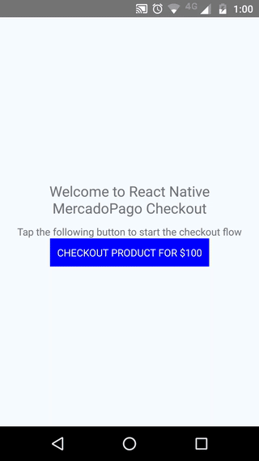

# React-Native MercadoPago Checkout 
> Simple react-native bridge for MercadoPago SDK v3.2.0

## Installation 

### YARN 

```bash
yarn add react-native-mercadopago-checkout
```

### NPM

```bash
npm install --save react-native-mercadopago-checkout
```

After installing this package run: 

```bash 
react-native link react-native-mercadopago-checkout
```

## Example

Check out the `/example` directory for a working demo of a react-native app triggering the MercadoPago components.



## Setup 
### IOS

1. Download MercadoPago´s [SDK for iOS](https://github.com/mercadopago/px-ios).
2. Open your project in XCode and drag MercadoPagoSDK.xcodeproj into the 'Libraries' folder of your app.
3. Navigate to the target configuration window by clicking on the blue project icon, and selecting the application target under the "Targets" heading in the sidebar.
4. In the 'General' panel, go to the 'Embedded Binaries' section.
5. Click on the '+' button and select 'MercadoPagoSDK.framework' under `Libraries > MercadoPagoSDK.xcodeproj > Products` from your project

## Usage

**MercadoPago SDK v3.2.0** has now two modes of checkout usage, one is for Payment which resolves the entire payment process, and the other, returns a PaymentData object that you've to send to your servers, so you can perform a payment manually. 

Because of that change, the react-native bridge exposes two static methods inside of a class that let you use the MP checkout in both ways.

### Start Checkout for PaymentResult

A PaymentResult object will look like: 

```json
{
   "id": "122323232",
   "status": "approved"
}
```

This is how to call the checkout for Payment, the first parament is the **publicKey**, the next one is the **preferenceId**, and the last one is object where you can pass style customization. 

```javascript
import { MercadoPagoCheckout } from 'react-native-mercadopago-checkout';

let payment = await MercadoPagoCheckout.startForPayment('xsddgfdsdasdsa', 'sdsdf13323', {
    backgroundColor: '#414141',
    enableDarkFont: true
});
```

### Start Checkout for PaymentData

A PaymentData object will look like: 

```json
{
   "cardIssuerId": "john doe",
   "cardTokenId": "xsdfdgfdgdgfg",
   "paymentMethodId": "visa",
   "campaignId": "xzdsdsd",
   "installments": "1"
}
```

This is how to call the checkout for PaymentData, the first parament is the **publicKey**, the next one is the **preferenceId**, and the last one is object where you can pass style customization. 

```javascript
import { MercadoPagoCheckout } from 'react-native-mercadopago-checkout';

let paymentData = await MercadoPagoCheckout.startForPaymentData('xsddgfdsdasdsa', 'sdsdf13323', {
    backgroundColor: '#414141',
    enableDarkFont: true
});
```

## Issues

If you found a bug, or you have an answer, or whatever. Please, open an [issue](https://github.com/BlackBoxVision/react-native-mercadopago-checkout/issues). We will do our best to fix it.

## Contributing

Of course, if you see something that you want to upgrade from this library, or a bug that needs to be solved, **PRs are welcome!**

## License

Distributed under the **MIT license**. See [LICENSE](https://github.com/BlackBoxVision/react-native-mercadopago-checkout/blob/master/LICENSE) for more information.
